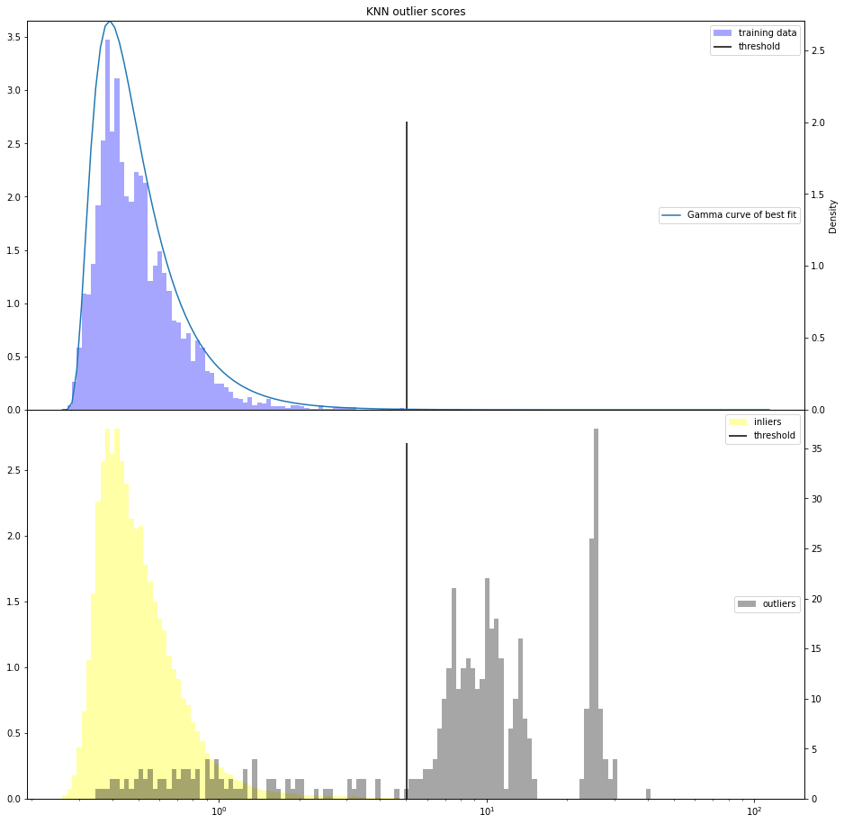
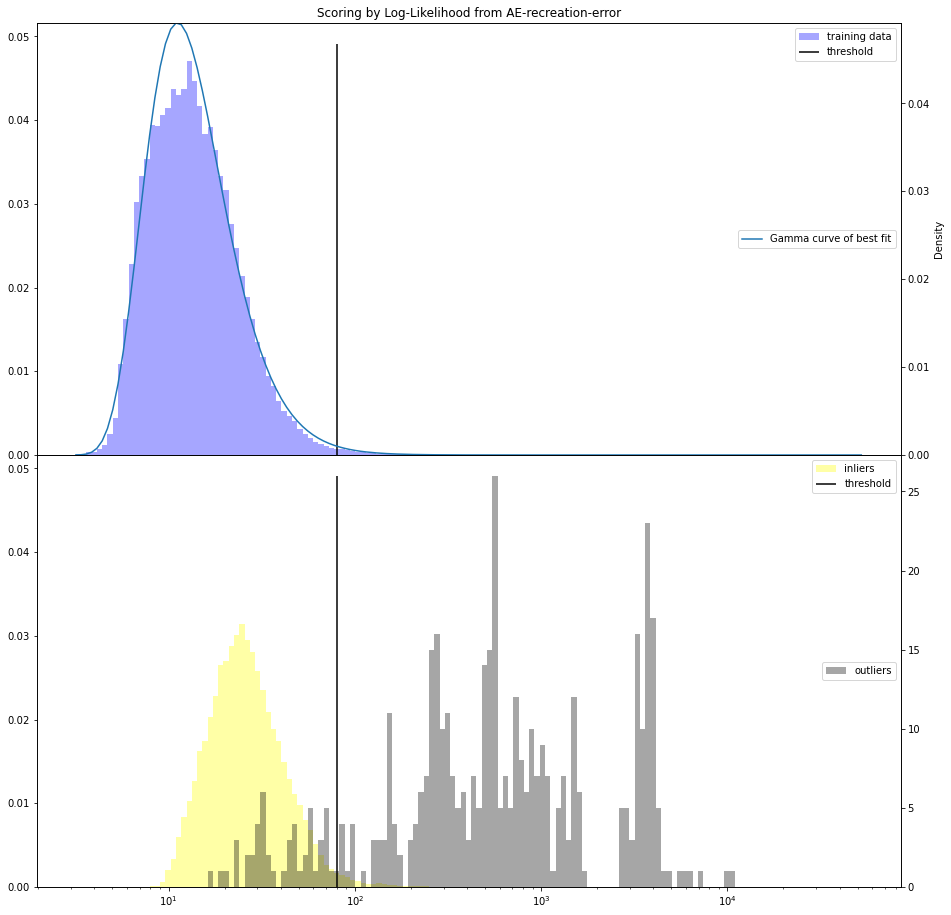

# Machine learning exam
Exam project comparing two different machine learning models (KNN and AE) on a dataset of fraudlent and legitimate credit card transactions.

# Data
You will need to download the data from: https://www.kaggle.com/mlg-ulb/creditcardfraud, and place it in the data folder to run the project. On the first ever execution, the preprocessing code will do all the nesecarry changes to this file and place the results under the data folder
this file must be called "creditcard.csv" in the data/ folder. This should then generate two new files, real.csv and fake.csv.
If the creditcard.csv is not in the folder, you will have to download it from kaggle, which requires you to have an account.
# Running the project:
The easiest way to run the project is through Anaconda Spyder, but you can also run the project from the terminal
***Note that both models have to be run from inside the SRC folder if you are executing from the terminal***

## KNN
Run the file knndist.py, either through Spyder or from the terminal
## Autoencoder
Like KNN, but run the file autoencoder.py

# Results
## KNN
Typical result of an execution of the KNN code:

```
predicting outliers based on knn outliers scores
[[119797     25]
 [   109    340]]
              precision    recall  f1-score   support

         0.0       1.00      1.00      1.00    119822
         1.0       0.93      0.76      0.84       449

    accuracy                           1.00    120271
   macro avg       0.97      0.88      0.92    120271
weighted avg       1.00      1.00      1.00    120271

AU-PRC: 0.7062789564959764
baseline: 0.0037332357758728205

[[119072    750]
 [    99    350]]
              precision    recall  f1-score   support

         0.0       1.00      0.99      1.00    119822
         1.0       0.32      0.78      0.45       449

    accuracy                           0.99    120271
   macro avg       0.66      0.89      0.72    120271
weighted avg       1.00      0.99      0.99    120271

AU-PRC: 0.4092182013415942
baseline: 0.0037332357758728205
Threshold: 5.278970487836807
Optimal threshold: 6.671499368837428
```
## Autoencoder


```
l2 report:
[[118438   1161]
 [   154    319]]
              precision    recall  f1-score   support

         0.0       1.00      0.99      0.99    119599
         1.0       0.22      0.67      0.33       473

    accuracy                           0.99    120072
   macro avg       0.61      0.83      0.66    120072
weighted avg       1.00      0.99      0.99    120072

AU-PRC:   0.31083608804509366
baseline: 0.003939303084815778
Threshold: 161.61855772834474
Optimal threshold: 136.04940136989558

AE-LL report:
[[116134   3465]
 [    68    405]]
              precision    recall  f1-score   support

         0.0       1.00      0.97      0.99    119599
         1.0       0.10      0.86      0.19       473

    accuracy                           0.97    120072
   macro avg       0.55      0.91      0.59    120072
weighted avg       1.00      0.97      0.98    120072

AU-PRC:   0.3524621480969143
baseline: 0.003939303084815778
Threshold: 157.69985694973795
Optimal threshold: 298.46366035132934

direct-LL report:
[[117604   1995]
 [   104    369]]
              precision    recall  f1-score   support

         0.0       1.00      0.98      0.99    119599
         1.0       0.16      0.78      0.26       473

    accuracy                           0.98    120072
   macro avg       0.58      0.88      0.63    120072
weighted avg       1.00      0.98      0.99    120072

AU-PRC:   0.27340540011681724
baseline: 0.003939303084815778
Threshold: 134.8904308391348
Optimal threshold: 135.24625587544423
```
## Average AURPC scores on 20 iterations:

| Support | Baseline | AE R²       | AE Log-likelihood | PureLog-likelihood | Mixed sample KNN; K = 10 | Inlier Only KNN; K=20 |
|---------|----------|-------------|-------------------|--------------------|--------------------------|-----------------------|
| 120492  | 0.0041   | 0.300 BF 100| 0.375 BF 145      | 0.310 BF 109       | 0.706 BF 588             | 0.457                 |
| 70492   | 0.007    | 0.400 BF 96 | 0.460 BF 120      | 0.407 BF 97        | 0.738                    | 0.515                 |
| 18467   | 0.027    | 0.660 BF 70 | 0.706 BF 86       | 0.664 BF 71        | 0.773                    | 0.717                 |
