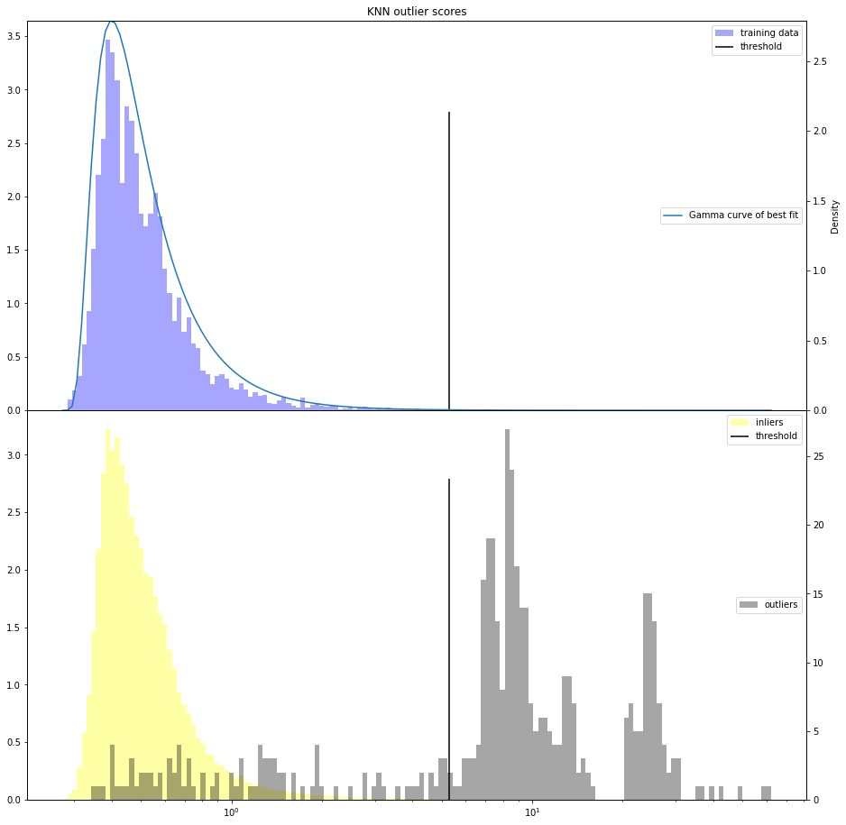
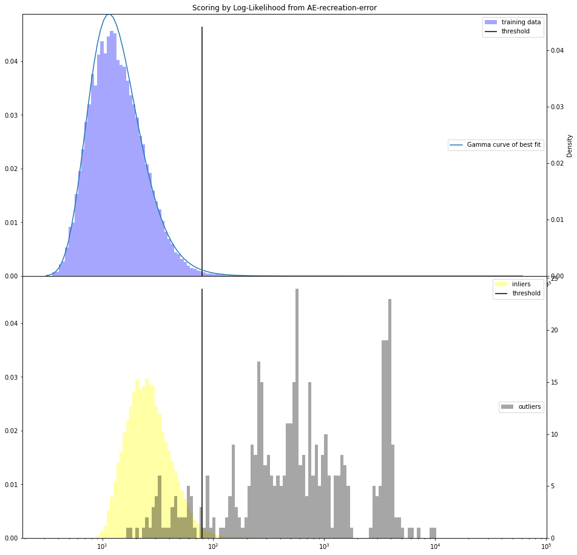

# Machine learning exam
Exam project comparing two different machine learning models (KNN and AE) on a dataset of fraudlent and legitimate credit card transactions.

# Data
You will need to download the data from: https://www.kaggle.com/mlg-ulb/creditcardfraud, and place it in the data folder to run the project. On the first ever execution, the preprocessing code will do all the nesecarry changes to this file and place the results under the data folder

# Running the project:
The easiest way to run the project is through Anaconda Spyder, but you can also run the project from the terminal
## KNN
The KNN model has to be run from the src folder, from there run the knndist.py file either in and IDE or from the terminal.

## Autoencoder
Like KNN, but run the file autoencoder.py

***Note that both models have to be run from inside the SRC folder if you are executing from the terminal***
# Results
## KNN
Typical result of an execution of the KNN code:

```
predicting outliers based on knn outliers scores
[[119797     25]
 [   109    340]]
              precision    recall  f1-score   support

         0.0       1.00      1.00      1.00    119822
         1.0       0.93      0.76      0.84       449

    accuracy                           1.00    120271
   macro avg       0.97      0.88      0.92    120271
weighted avg       1.00      1.00      1.00    120271

AU-PRC: 0.7062789564959764
baseline: 0.0037332357758728205

[[119072    750]
 [    99    350]]
              precision    recall  f1-score   support

         0.0       1.00      0.99      1.00    119822
         1.0       0.32      0.78      0.45       449

    accuracy                           0.99    120271
   macro avg       0.66      0.89      0.72    120271
weighted avg       1.00      0.99      0.99    120271

AU-PRC: 0.4092182013415942
baseline: 0.0037332357758728205
Threshold: 5.278970487836807
Optimal threshold: 6.671499368837428
```
## Autoencoder


```
r2 report:
[[115883   3723]
 [   168    281]]
              precision    recall  f1-score   support

         0.0       1.00      0.97      0.98    119606
         1.0       0.07      0.63      0.13       449

    accuracy                           0.97    120055
   macro avg       0.53      0.80      0.55    120055
weighted avg       1.00      0.97      0.98    120055

AU-PRC:   0.059480701265928936
baseline: 0.0037399525217608597
Threshold: 1.0538036036520326
Optimal threshold: 1.0874440712669367

AE-LL report:
[[110501   9105]
 [    49    400]]
              precision    recall  f1-score   support

         0.0       1.00      0.92      0.96    119606
         1.0       0.04      0.89      0.08       449

    accuracy                           0.92    120055
   macro avg       0.52      0.91      0.52    120055
weighted avg       1.00      0.92      0.96    120055

AU-PRC:   0.31884060146866505
baseline: 0.0037399525217608597
Threshold: 79.63714409945796
Optimal threshold: 243.18283662872676

direct-LL report:
[[114869   4737]
 [    61    388]]
              precision    recall  f1-score   support

         0.0       1.00      0.96      0.98    119606
         1.0       0.08      0.86      0.14       449

    accuracy                           0.96    120055
   macro avg       0.54      0.91      0.56    120055
weighted avg       1.00      0.96      0.98    120055

AU-PRC:   0.28141895166384373
baseline: 0.0037399525217608597
Threshold: 75.07279882307225
Optimal threshold: 141.51047235194082
```
## Average AURPC scores on 20 iterations:

| Support | Baseline | AE R²       | AE Log-likelihood | PureLog-likelihood | Mixed sample KNN; K = 10 | Inlier Only KNN; K=20 |
|---------|----------|-------------|-------------------|--------------------|--------------------------|-----------------------|
| 120492  | 0.0041   | 0.099 BF 27  | 0.375 BF 145      | 0.310 BF 109       | 0.706 BF 588             | 0.457                |
| 70492   | 0.007    | 0.172 BF 29  | 0.460 BF 120      | 0.407 BF 97        | 0.738                    | 0.515                |
| 18467   | 0.027    | 0.387 BF 22  | 0.706 BF 86       | 0.664 BF 71        | 0.773                    | 0.717                |
| 6467    | 0.072    | 0.611 BF 20  | 0.831 BF 63       | 0.811 BF 55        | 0.778                    | 0.822 BF 65          |
